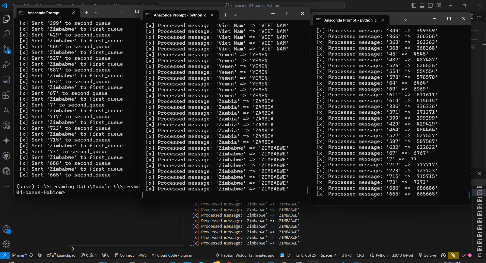

# Streaming-04-bonus-Habtom

This project demonstrates a data processing pipeline using RabbitMQ with a producer and two consumers.

Author: Habtom Woldu

Date: May 22, 2024

Introduction
The provided Python code streamlines the processing of data from a multi-column CSV file through the utilization of RabbitMQ queues. This project offers an efficient way to split and process data from an input CSV file and apply specific transformations to the extracted information. By distributing the workload to multiple worker processes, this code demonstrates the power of RabbitMQ in managing concurrent data processing tasks.

Before You Begin
Fork this starter repo into your GitHub.
Clone your repo down to your machine.
View / Command Palette - then Python: Select Interpreter.
Select your conda environment.
Read
Read the RabbitMQ Tutorial - Work Queues.
Modify the publisher script (publisher.py) to send data to RabbitMQ queues.
Run the publisher script to populate the queues.
Run consumer1.py and consumer2.py to process the data and write results to CSV files.

Project Structure
publisher.py: Sends data from data.csv to two RabbitMQ queues.
consumer1.py: Monitors the first queue, performs transformations, and writes to data-result1.csv.
consumer2.py: Monitors the second queue, performs transformations, and writes to data-result2.csv.
data.csv: Original CSV file, input CSV file with multiple columns.
data-result1.csv: Output CSV file for processed data from consumer 1.
data-result2.csv: Output CSV file for processed data from consumer 2.
README.md: Project documentation.
Reference

# Run 

Run the three python files in the bash: in anaconda Prompt (miniconda3) run these:
python publisher.py
python consumer1.py
python consumer2.py

# # Multiple Screen

See a running example with at least 3 concurrent process windows here

- [RabbitMQ Tutorial - Work Queues](https://www.rabbitmq.com/tutorials/tutorial-two-python.html)

# Source Data for CSV 
https://www.kaggle.com/datasets/kumarajarshi/life-expectancy-who?resource=download

